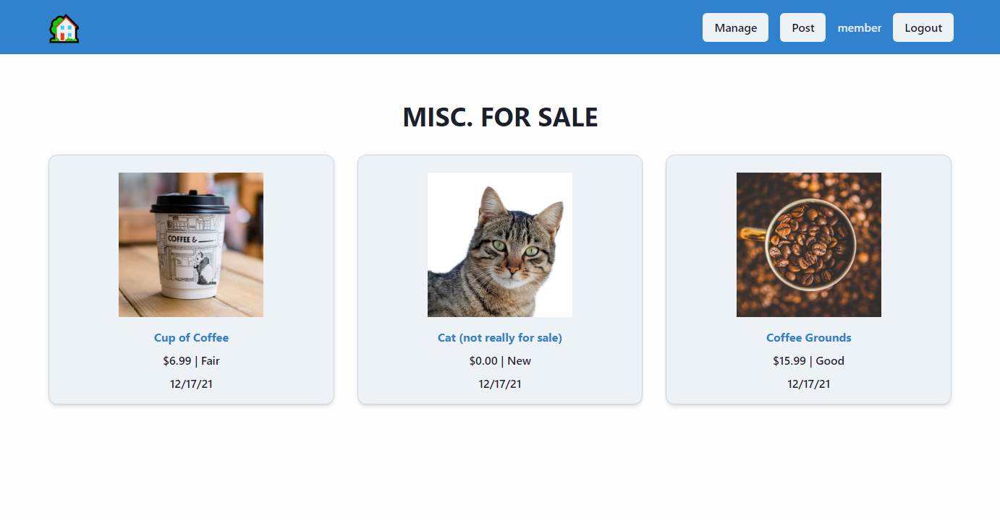

### Table of Contents

- [Summary](#summary)

- [Usage](#usage)

- [Backend](#backend)

- [Git](#git)

- [Images](#images)

## Summary (simplified)

- Run `dotnet restore` inside the API project to grab the dependencies.

- Run `dotnet run` to run the backend API project.

  - Server will run on `http://localhost:5100/api`

- Install frontend dependencies with `npm install` inside the `./Next` relative directory.

- Run frontend project with `npm run dev`

  - App will be server on `http://localhost:1234`

> Below are two default users provided for you to sign in if needed.

You can also navigate to the register page and create a user using some mock data.

| Username |       Email       | Password |
| -------- | :---------------: | -------: |
| admin    | admin@domain.net  |    admin |
| member   | member@domain.net |   member |

## Usage

- In the navbar you can find the main actions provided to navigate as a user.

  - If not logged in you will be prompted on the top right to either Login or Register

  - Once signed in you will have the option to either "post a new item for sale", or logout.

    - There is a manage page. I was planning on having logic here to render a list of item postings that belong to the signed in user where they can manage their posts.

    - When a user is signed in. And they view an item, they will have the option to archive and remove their post.

- When navigating to `http://localhost:1234/` you will be greeted with the default homepage which renders a list of categories to navigate to.

- When you click on a category you will be redirected to the `for-sale/{category}` page. Each for sale page will contain all the relevant posts specific to that category.

  - You can click on the title of the post card to view the specific post detail.

- I've included some screenshots at the end of the README if you'd like to take a look.

## Backend

#### Tools

- Project is an asp.net core 6.X web api project

  - I used the `dotnet` CLI version `6.0.100`

  - I used the `dotnet-ef` CLI version `6.0.1`

#### Project dependencies

- NuGet dependencies used:

  - [AutoMapper](https://www.nuget.org/packages/AutoMapper.Extensions.Microsoft.DependencyInjection/)

  - [CloudinaryDotNet](https://www.nuget.org/packages/CloudinaryDotNet/)

    - The API keys, secret, and config are located in the `appsettings.json` file I've provided.

      - I can delete these credentials after testing in my Cloudinary dashboard.

  - [Microsoft.AspNetCore.Authentication.JwtBearer](https://www.nuget.org/packages/Microsoft.AspNetCore.Authentication.JwtBearer/)

  - [EF Core Sqlite](https://www.nuget.org/packages/Microsoft.EntityFrameworkCore.Sqlite/)

    - I have provided a local copy of the `app.db` which contains some data that I used for testing. If you clone this project or the file does not exist. Some seed data will be provided for testing.

#### Running the project

- You can run the project using either the `dotnet run` or `dotnet watch run` commands.

- The backend will run on `http://localhost:5100/api`

  - For this small demo I've disabled the default https redirect logic. It made it easier to work with a normal react project running locally on http.

## Frontend

#### Tools

I built the frontend using Next.js + Typescript

On my machine I ran the project using Node `v16.13.1` and npm version `8.1.2`

#### Running the project

- I've excluded the `node_modules/` directory to minimize file size. Install the project dependencies by running `npm install` inside the `./Next` relative directory.

- You can run the project using the `npm run dev` command inside of the `./Next` relative directory.

- The frontend app will be served on `http://localhost:1234`

## Git

Primarily checkout into smaller feature branches and would merge them back into master.

For the purpose of this small demo I did not really need to revisit older branches to pick up where I left off / add new features or update logic once done. If I had to revist features or sections of the application to further expand on the existing logic, I would merge in the latest changes from the master branch to keep everything up to date.

## Images

#### Home Page

#### Category Page

#### Create Post Page

#### Post Detail Page

